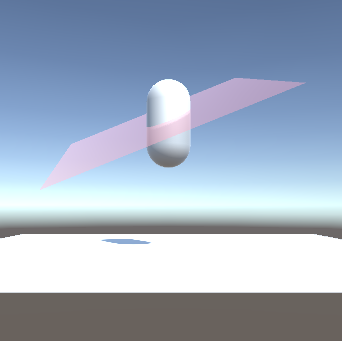
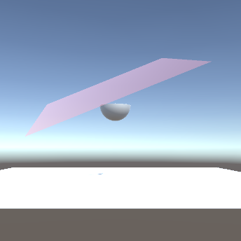

# Unity Mesh Manipulation Test

This is a repository for testing unit Mesh features. It includes the direct access to vertices, normals, uvs and triangles.

# Current Update

* Delete triangles over a plane.

